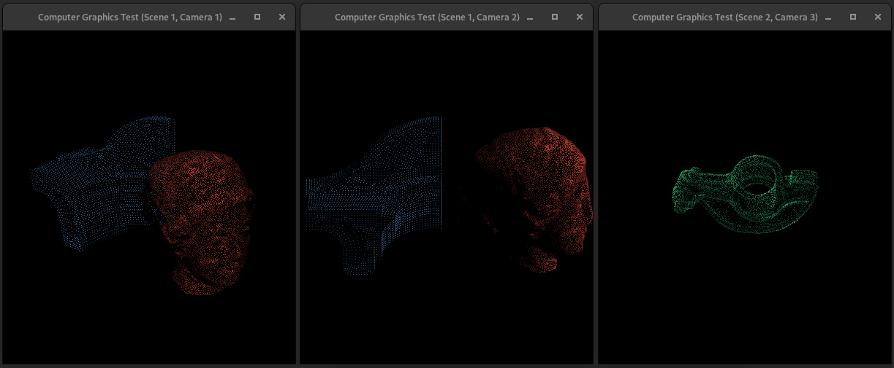

# computer-graphics
Some experiments about computer graphics.

It implements a Camera, Object, Scene, and some rendering and transformation functions. The Camera windowing system is based on
*wxPython*.

<p align="center">
  
  <br><em>Demo using two scenes, Scene 1 with two cameras and Scene 2 with just one camera.</em>
</p>


## Dependencies
- [numpy 1.20](https://pypi.org/project/numpy/1.20.0/): used `np.array`, `np.full`, `np.matmul`, `np.dot`, `np.cross` and `np.linalg.norm`;
- [webcolors 1.11](https://pypi.org/project/webcolors/1.11/): converts HEX code to RGB;
- [wxPython 4.1](https://pypi.org/project/wxPython/4.1.0/): windowing system which provides a bitmap canvas to freely
  draw into, besides a plenty of useful features.

The easiest method to install the requirements is thought a Python environment managed by Conda or Anaconda. If you 
don't have one setup, we recommend using [miniconda](https://docs.conda.io/en/latest/miniconda.html) because it's 
a minimal installer for conda that includes only conda, Python and a few other utility packages.

After setting up your Conda installation, run the following commands:

```shell
# create a Python environment called `cg`
conda create -n cg

# entering the newly created environment
conda activate cg

# installing the requirements
conda install -c conda-forge numpy=1.20 webcolors=1.11 wxpython=4.1
```

> 💡 You can install each dependency by hand using *pip*, but it's a more complicated process involving compiling 
> *wxPython* specifically for your platform. That's out of the scope of this guide, so read 
> [this](https://wxpython.org/pages/downloads/) page for more information.


## Usage
Usage as in [src/main.py](src/main.py):

```python3
from Camera import Camera
from Object import Object
from Scene import Scene
from LightSource import LightSource

if __name__ == '__main__':
    s1 = Scene(.1)
    s2 = Scene(.4)

    ls1 = LightSource([5_000., 5_000., -5_000.], 1.)
    s1.add_light_source(ls1)

    ls2 = LightSource([5_000., 5_000., -5_000.], 1.)
    ls3 = LightSource([-5_000., -5_000., -5_000.], .3)
    s2.add_light_source(ls2)
    s2.add_light_source(ls3)

    obj1 = Object('./3d-obj-examples/coarseTri.fandiskAuto.obj', '#4070a0')
    obj1.translate(-0.5, 0, 0)
    obj1.scale(200)
    s1.add_object(obj1)

    obj2 = Object('./3d-obj-examples/coarseTri.egea1.obj', '#e74c3c', .7, 1., 5)
    obj2.translate(0.5, 0, 0)
    obj2.scale(200)
    s1.add_object(obj2)

    obj3 = Object('./3d-obj-examples/coarseTri.rockerArm.obj', '#208050', .3, 1., 5)
    obj3.scale(200)
    obj3.rotate_y(90)
    obj3.rotate_x(30)
    s2.add_object(obj3)

    cam1 = Camera(s1)
    cam1.rotate_y(-50)
    cam1.rotate_x(20)

    cam2 = Camera(s1)
    cam2.rotate_x(20)

    cam3 = Camera(s2)

    Scene.main_loop()
```


## Running
After installing the requirements, you need to `cd` to the project root then activate your Python environment:

```shell
conda activate cg
```

If you see `(cg)` at the beginning of the command line, you're ready to go. Run the project using the command:

```shell
python3 src/main.py
```

You can interact with each Camera using the following commands:
- `RIGHT`: right (`translate(C, 0, 0)`)
- `LEFT`: left (`translate(-C, 0, 0)`)
- `UP`: front (`translate(0, 0, C)`)
- `DOWN`: back (`translate(0, 0, -C)`)
- `SHIFT + UP`: up (`translate(0, C, 0)`)
- `SHIFT + DOWN`: down (`translate(0, -C, 0)`)
- `CTRL + RIGHT`: positive yaw (`rotate_y(-D)`)
- `CTRL + LEFT`: negative yaw (`rotate_y(D)`)
- `CTRL + UP`: positive pitch (`rotate_x(-D)`)
- `CTRL + DOWN`: negative pitch (`rotate_x(D)`)
- `CTRL + SHIFT + RIGHT`: positive roll (`rotate_z(-D)`)
- `CTRL + SHIFT + LEFT`: negative roll (`rotate_z(D)`)

To terminate the execution you can close all windows one by one or hit `CTRL + C` on the terminal.


## Troubleshooting
If you encounter any error, it probably might be related to *wxPython* and it's dependencies:

- ``ImportError: /path/to/miniconda3/envs/cg/bin/../lib/libstdc++.so.6: version `CXXABI_1.3.13' not found 
  (required by /path/to/python3.9/site-packages/wx/libwx_baseu-3.1.so.5)``: it means that there's a wxPython installed 
  within your main Python install. You can uninstall it (`pip uninstall wxpython`) and try to run again;
- `Gtk-Message: 18:21:48.703: Failed to load module "canberra-gtk-module"` and `Gtk-Message: 18:21:48.703: Failed to 
  load module "pk-gtk-module"`: as this project doesn't use features provided by these modules, they're not needed. This 
  error can be safely ignored.


## TODO
- [x] Reading at least one 3D object
- [x] Resizing and positioning of the objects in a virtual scene
- [x] Camera
- [x] Z-buffer
- [x] Planar projection
- [ ] Perspective projection
- [x] Object rendering
- [ ] Fix face rasterization: do maths using *ints* not *floats*. FIX: [Rasterization.py](src/Rasterization.py)
- [x] Export or view the rendered scene
- [x] Define at least one light source
- [-] Implement *Phong* and/or *Gouraud* shading techniques (*flat* shading implemented)
- [ ] Export docstrings to Markdown documentation
